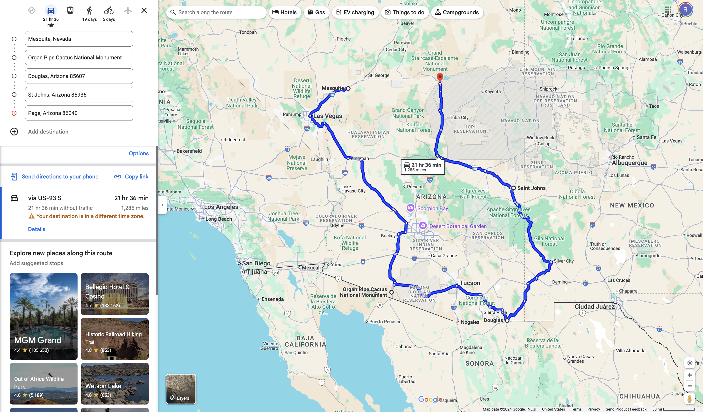
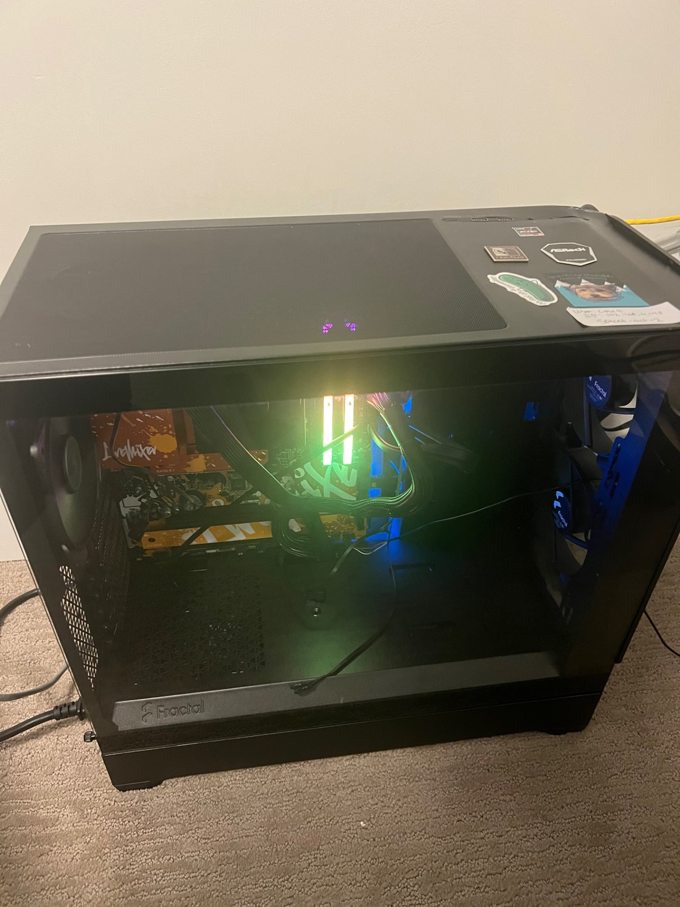
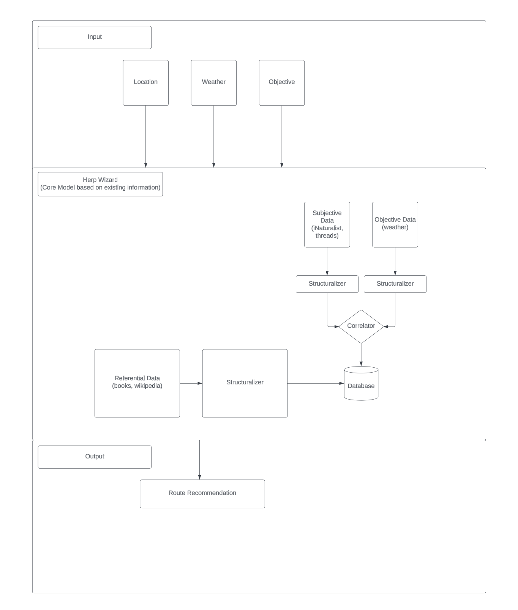
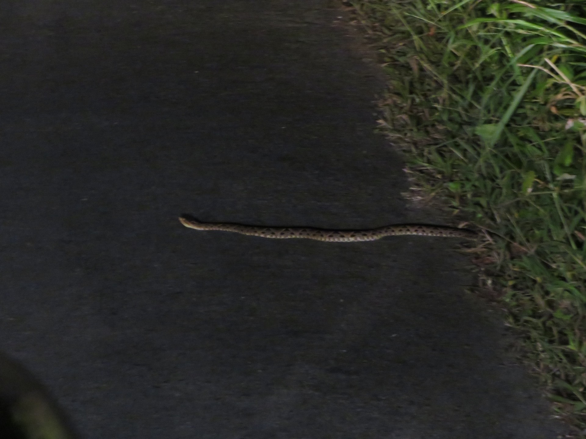

## An Overview

Since the Covid pandemic (roughly summer of 2020) I have been a casual, self-proclaimed amateur [herpetology](https://en.wikipedia.org/wiki/Herpetology) enthusiast. While certainly not something I actively pursue all the time (nor something I engage with as impressively as [my brother](https://madurst22.github.io/)), I have spent quite a few hours roaming around deserts and cruising through the Florida Everglades in search of slimy serpents. Such "expeditions" have lead to some incredible and memorable trips with my brother as we've ventured to places like:

* Death Valley, California
* Osa Peninsula, Costa Rica
* Arecibo, Puerto Rico
* St. George, Utah

At this point, I've seen [58 snake species](https://github.com/robertDurst/lifers_list/tree/main). 

Like the true amateur I am, thus far in my journey the most effective strategy for locating snakes has been _road cruising_; snakes are cold blooded and thus as the air temperature drops at the end of the day, diurnal and nocturnal species will venture out on to the road to warm up. 

A typical night of cruising will start around the golden hour on a paved, less busy stretch of road (identified based on some combination of terrain/geography/[iNaturalist](https://www.inaturalist.org/)/etc.) and last until temperature drops too low, the target has been spotted, or we just give up. This approach is incredibly [brute force](https://en.wikipedia.org/wiki/Proof_by_exhaustion). Since we're in a car we can cover maximal distance and since we're road cruising we aren't _flipping rocks_, _climbing through washes_, etc... more or less I've made the _bare minimum_ amount of decisions to give myself a slight edge over someone who randomly is driving around at night staring at the road. Folks with more success will place cover, consult local experts, and generally _dedicate time to learning more about habitat, behavior, etc._.

While I have purchased books and spent some time attempting to be more intentional about improving my odds of success, I've always wondered if I could leverage machine learning to aid this process. Can we select road cruising routes based on estimated temperature differences between the air and road? Can we use computers to scan satellite imagery for us to identify more probably spots? Ultimately, can we leverage all the objective and subjective information on the internet to develop a model to significantly improve our herping success?

**I believe we can.**

***

## The Plan

To test our hypothesis we're going to homebrew an LLM model on our own hardware to calculate routes for us in pursuit of finding all 13 species of rattlesnakes in Arizona ([which is actually 1/3 of all rattlesnakes in the world](https://arizonasnakefence.com/rattlesnake-information/)). 

It takes about 21.5 hours to circumnavigate Arizona.

So since the range of rattlesnakes covers most of the state and since we might need certain weather windows, we'll give ourselves *six days*, which is ~2 snake species per day (my brother and I have already seen a Western Diamondback employing our brute force tactics so feel pretty good about that one...).

With the help of [How to Build an LLM from Scratch by Sebastian Raschka](https://www.manning.com/books/build-a-large-language-model-from-scratch) we'll scrape a ton of herping related data and then develop an LLM specific to finding snakes.

### Hardware

For the training and self-hosting we'll repurpose existing hardware.

**Motherboard**: [ASRock B650 LiveMixer AM5 ATX Motherboard](https://www.newegg.com/asrock-b650-livemixer-atx-amd-b650-am5/p/N82E16813162099R?srsltid=AfmBOoonYPcQScYBpJosgV1U1C7JRV5v9jqZ1JMNnjkeXkHw46ZFp-6G)

**Power Supply**: [CORSAIR RM750e](https://www.corsair.com/us/en/p/psu/cp-9020262-na/rme-series-rm750e-fully-modular-low-noise-atx-power-supply-cp-9020262-na?srsltid=AfmBOoo-XaKAHDHVLpNJFbyfVHTLVpDS9gNTs_GIP5KgRP1czrnB0qLM)

**RAM**:
  * [4x 16gb DDR5 DRAM](https://www.corsair.com/us/en/p/memory/cmh32gx5m2b6400c32/vengeance-rgb-32gb-2x16gb-ddr5-dram-6400mhz-c32-memory-kit-black?srsltid=AfmBOorcbctZT6y-n7nwdW3nLoSTnlN-JcxjUeJONMcn17OlQAURAZKj)

**Storage**:
  * [512gb SSD](https://www.teamgroupinc.com/en/product-detail/ssd/TEAMGROUP/mp33/mp33-TM8FP6512G0C101/)
  * [8tb HDD](https://www.seagate.com/products/hard-drives/barracuda-hard-drive/)

**CPU**:
  * [6 cores, 12 threads, 4.7 GHz](https://www.amd.com/en/products/processors/desktops/ryzen/7000-series/amd-ryzen-5-7600x.html)

Will probably get a GPU once performance clearly becomes an issue and thus the extra cost is warranted. To get started, don't believe this will be necessary since the [LLM from Scratch book's Github README](https://github.com/rasbt/LLMs-from-scratch) states:

> The code in the main chapters of this book is designed to run on conventional laptops within a reasonable timeframe and does not require specialized hardware. This approach ensures that a wide audience can engage with the material. Additionally, the code automatically utilizes GPUs if they are available. (Please see the setup doc for additional recommendations.)

While we _could_ do this in the cloud and leverage existing models, this is equal parts "let's go do a thing" and "let's go learn a thing". 

### Software

This is just a first, high-level overview.

### Summary of Objective

**[Goal]**: photograph all 13 species of rattlesnakes in Arizona  
**[Time Limit]**: 6 days  
**[Limitations]**: 
  * self-hosted software
  * own hardware (no cloud, no super powered GPUs)
  * own models (no fine-tuning an existing model)
  * 6 months from first line of code to expedition

***

#### Credits

Thanks to my brother for joining me in this journey (and bringing the optimism to all our trips regardless of our success). Thanks to my wife for embracing this weird hobby (and even photography a [terciopelo](https://en.wikipedia.org/wiki/Bothrops_asper) for me in Costa Rica). 

And finally thanks to [Will Robertson](https://www.youtube.com/@WillRobertsonsWildlife) for introducing me to herping second hand through my brother. If you're interested in what herping looks like from someone who is passionate, successful, and generally just a great guy, check out Will's Youtube channel _Will Robertson Wildlife_.
